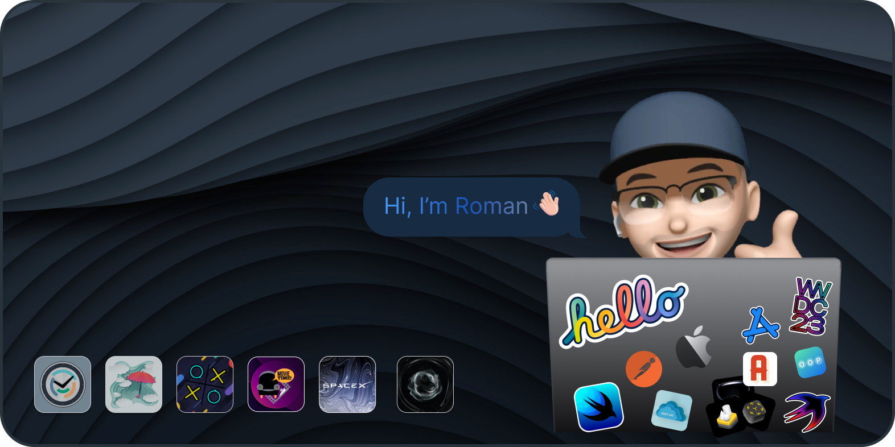

    

# Cineflix
Final project at the end of training at SkyLab. It’s a cinematic library with which you will not miss news from the world of cinema: short synopsis, trailers, rating

> UIKit, integrate SwiftUI to UIKit, Light/Dark mode, MVVM, TMDB API, Splash Launch Screen(SwiftUI), Custom Intro PageController(SwiftUI), Storyboard(LoginViewController), Authentication, User verification or Guest session, Alamofire, Locksmith, Adding movies to your favorites with TheMoviedb synchronization, SDWebImage, Lottie Animation, YoutubeiOSPlayerHelper, SafariServices, CocoaPods, Custom UIElements, IBInspectable, IBDesignable, UIProgrammatically, Autolayout, Custom UICollectionView/UITableView Cell, UICollectionViewCompostionalLayout, Custom UISegmentedControl, UIAlert, Pagination

# ChatGPT
Implemented chat for iOS watchOS macOS using the OpenAi platform

> SwiftUI, Dark mode only, OpenAIApi, Alamofire, Matrix effect, Custom animation

# Stock Market Clock
Implemented a stock clock with a 24-hour dial and the working hours of world stock exchanges

> SwiftUI, Light and Dark mode, Parralax effect, CircleText, Animation, GMT TimeZone

# Tic Tac Toe
Implemented well-known game tic-tac-toe with a choice of difficulty levels

> SwiftUI, CustomView, Alert, Play with friend or AI

# WeatherTracker
Implemented a simple weather viewer application using geolocation

> UIKit, CustomUI, CoreLocation, UIAlert, OpenWeatherApi, JSON, Lottie Animation

