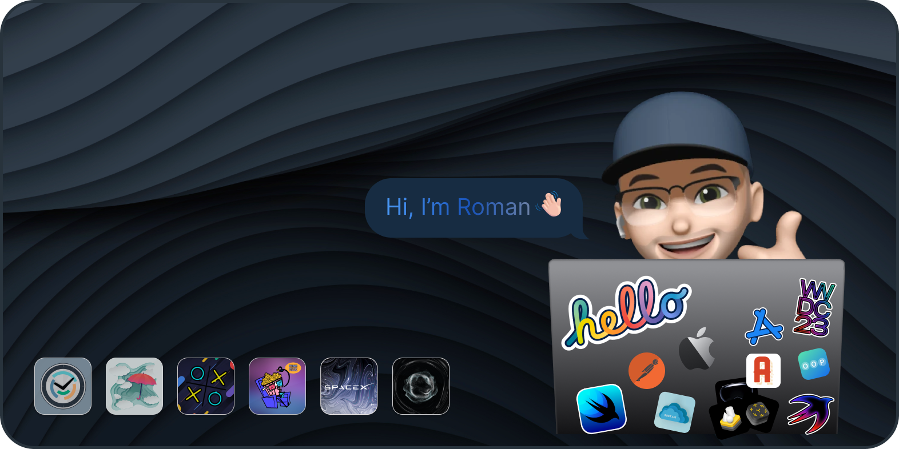

# ChatGPT
Implemented chat for iOS watchOS macOS using the OpenAi platform

> SwiftUI, Dark mode only, OpenAIApi, Alamofire

# Stock Market Clock
Implemented a stock clock with a 24-hour dial and the working hours of world stock exchanges

> SwiftUI, Light and Dark mode, Parralax effect, CircleText, Animation, 

# Tic Tac Toe
Implemented well-known game tic-tac-toe with a choice of difficulty levels

> SwiftUI  

# WeatherTracker
Implemented a simple weather viewer application using geolocation

> UIKit, CustomUI, CoreLocation, UIAlert, OpenWeatherApi, JSON, Lottie Animation

